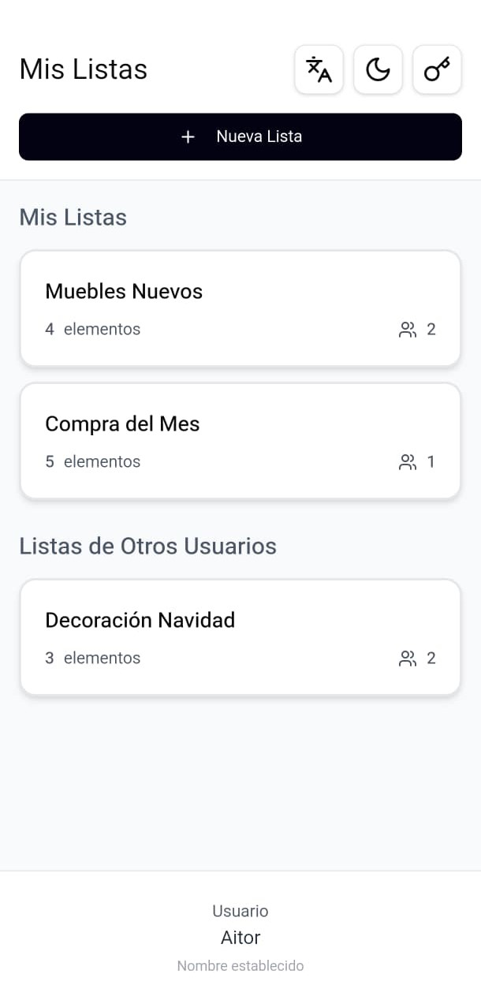
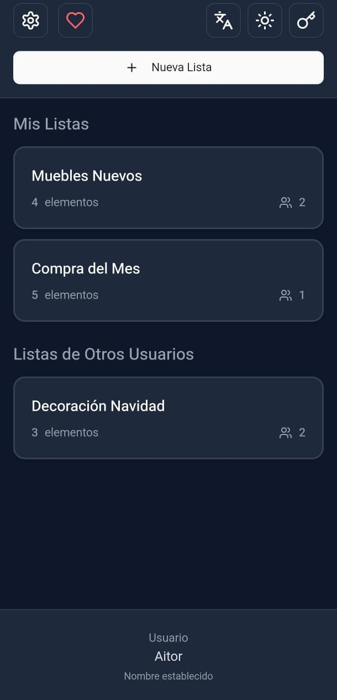
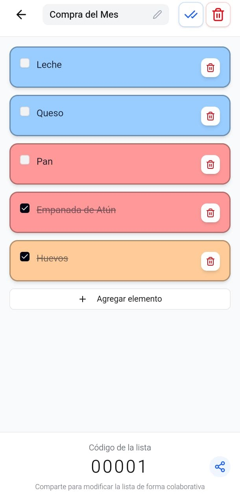
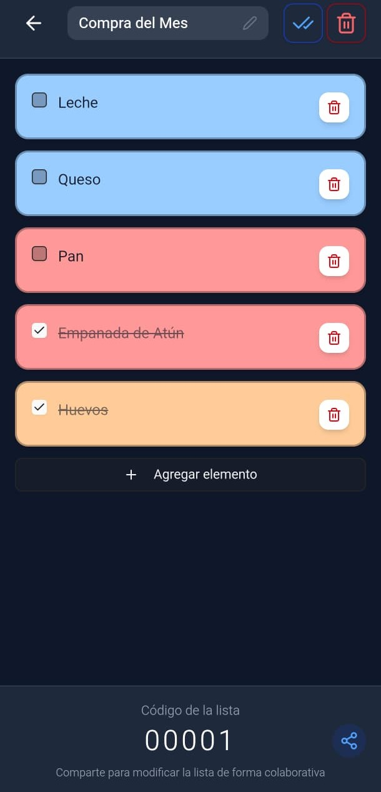
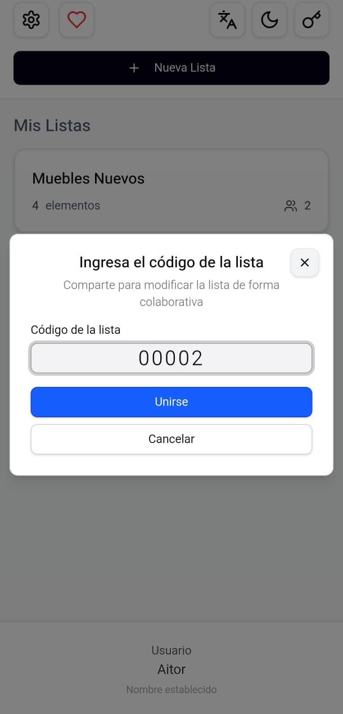
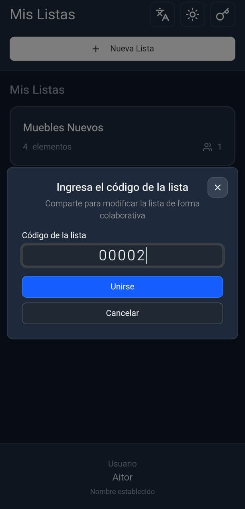
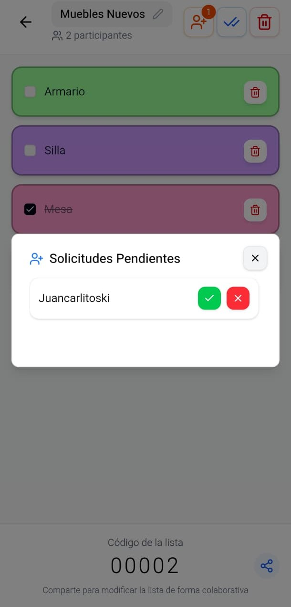
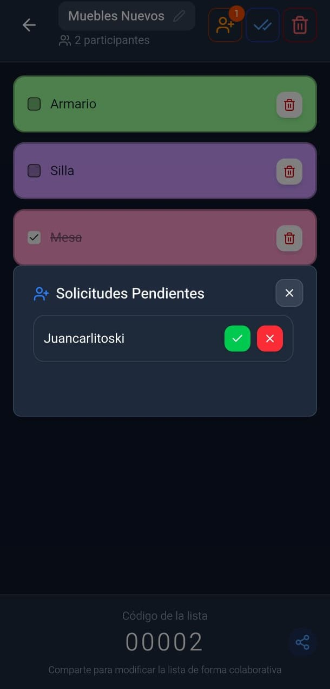

<div align="center">
  
  <h1>Mother Of Lists</h1>
  <p><i>Sincronización real-time para hogares modernos.</i></p>
</div>

# 📝 Collaborative Lists App

[](https://reactjs.org/)
[](https://firebase.google.com/)
[](https://tailwindcss.com/)
[](#)

## 🌟 El Origen: Una solución real para problemas reales

Este proyecto nació de una necesidad cotidiana: **mejorar la experiencia de mis padres con las listas de la compra.** Cansado de las interfaces saturadas y la publicidad invasiva de apps como *Listonic*, decidí crear una alternativa propia.

Es mi primera incursión en el ecosistema de **Firebase**, diseñada con un objetivo claro: **Cero distracciones, cero publicidad y sincronización instantánea.** Lo que empezó como un regalo familiar terminó siendo una exploración profunda en arquitecturas *real-time* y persistencia nativa.

---

## 📱 Capturas de Pantalla

| Vista Principal: Modo Claro | Vista Principal: Modo Oscuro | Vista Lista: Modo Claro | Vista Lista: Modo Oscuro |
| :---: | :---: | :---: | :---: |
|  |  |  |  |

| Código: Modo Claro | Código: Modo Oscuro | Solicitudes: Modo Claro | Solicitudes: Modo Oscuro |
| :---: | :---: | :---: | :---: |
|  |  |  |  |

---

## 📲 Descarga Directa (APK)

Si no quieres complicarte con el código y solo quieres probar la app en tu Android, puedes descargar la última versión estable directamente desde este repositorio:

📦 **[Descargar molv1.0.apk](./apk/molv1.0.apk)** *(O búscala en la sección de **Releases** de este GitHub)*

---

## ✨ ¿Qué hace especial a esta App?

### 👥 Colaboración Pura
* **Sincronización en milisegundos:** Gracias a Firestore, lo que uno escribe, el otro lo ve al instante.
* **Acceso mediante Código:** Comparte listas de forma segura con un simple código numérico.
* **Control de Propietario:** Sistema de gestión para aceptar participantes y proteger la integridad de tus listas.

### ✅ Gestión Inteligente
* **Categorización por Colores:** 7 tonos vibrantes para organizar tus productos visualmente.
* **Animaciones "Bounce":** Interfaz fluida construida con `Framer Motion`.
* **Modo Offline:** La app sigue funcionando incluso si pierdes la conexión momentáneamente.

### 🌍 Adaptabilidad Total
* **Multilingüe:** Soporte nativo para **Español e Inglés**.
* **Modo Oscuro:** Detección automática según la configuración de tu sistema.
* **Diseño Moderno:** Optimizada para pantallas con notch y cámaras integradas (Safe Area).

---

## 🛠️ Ejecución para Desarrolladores

Si quieres explorar las tripas del proyecto o lanzarlo en tu navegador, el proceso es minimalista:

### 1. Clonar e Instalar
```bash
git clone [https://github.com/Aitorsiius/mother-of-lists](https://github.com/Aitorsiius/mother-of-lists)
cd mother-of-lists
npm install
```

### 2. Configuración de Firebase
Necesitarás un archivo `.env` en la raíz con tus credenciales de Firebase (Firestore + Auth Anónimo):
```bash
VITE_FIREBASE_API_KEY=...
VITE_FIREBASE_AUTH_DOMAIN=...
VITE_FIREBASE_PROJECT_ID=...
VITE_FIREBASE_STORAGE_BUCKET=...
VITE_FIREBASE_MESSAGING_SENDER_ID=...
VITE_FIREBASE_APP_ID=...
```

### 3. Lanzar el entorno de desarrollo
```bash
npm run dev
```
---

## 📄 Notas Técnicas
* **Arquitectura:** React 18 + TypeScript + Vite.
* **Capa Nativa:** Capacitor.
* **Backend:** Serverless con Firebase Cloud Services.
* **Seguridad:** Identificación única por dispositivo mediante Auth Anónimo y persistencia local de preferencias.

## ⚖️ Licencia

Este proyecto está bajo la Licencia GNU GPL v3. Consulta el archivo `LICENSE` para más detalles.

---
*Nota: Queda prohibida la redistribución de la APK adjunta en este repositorio en plataformas de terceros sin el consentimiento del autor.*

Desarrollado con ❤️ para que mis padres no vuelvan a ver un anuncio mientras deciden qué comprar.
